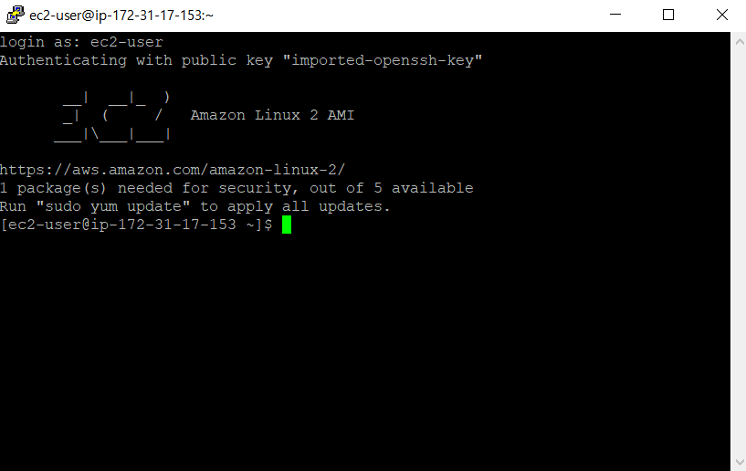

## EC2(서버) 설정하기

1. [AWS 홈페이지](https://aws.amazon.com/ko/free/)에 접속 후 로그인을 하고 콘솔 창으로 이동을 합니다.

2. 모든서비스에 보면 [EC2](https://us-east-2.console.aws.amazon.com/ec2/v2/home?region=us-east-2#Home:)로 들어갑니다.

* _Create/img/1.png)

3. 위의 화면에서 인스턴스 시작을 누릅니다.

* _Create/img/2.png)

4. 위의 화면에서 서버 속성, 설명을 보고 자신이 원하는 서버를 선택합니다.(저는 Amazon Linux 2 AMI (HVM), SSD Volume Type을 이용해 설정해 보겠습니다.)

* _Create/img/3.png)

5. 여기에서 인스턴스 유형을 선택하고 다음을 선택합니다. (저는 프리티어 속성으로 진행 하겠습니다.)

* _Create/img/4.png)

6. 여기에서 세부 설정을 진행합니다.(저는 종료방지 기능 활성화만 하고 나머지는 기본 설정으로 진행하겠습니다.)

* _Create/img/5.png)

7. 여기에서 스토리지 크기를 설정합니다.(저는 기본 설정으로 진행합니다. 다음은 태그 설정인데 따로 넣진 않았습니다.)

* _Create/img/6.png)

8. 여기에서 보안그룹을 작성하고 시작을 하겠습니다.(여기에서 보안그룹을 작성해도 되지만 저는 후에 추가하도록 하겠습니다.)

* _Create/img/7.png)

9. 시작을 누르면 위의 화면이 뜹니다. 이 때 새 키 페어 생성으로 키페어 이름을 작성하고 다운로드를 합니다.(절대 다시 다운 받을 수 없으므로 잘 저장해 놓습니다.) 그리고 인스턴스 시작을 합니다.

10. 이제 인스턴스가 생성되었습니다. putty를 이용해 접속하기 전에 위에서 다운로드 받은 pem 파일을 ppk 파일로 변경해야 합니다. (mac은 인터넷에서 찾아서 진행해 주세요.) 윈도우 검색창에 puttyGen을 검색해 실행합니다. 그럼 아래의 화면이 뜹니다.

* _Create/img/8.png)

11. 위의 화면에서 Conversions -> import key에서 다운로드 받으신 pem파일을 넣어주시면 아래에 Type을 RSA로 하고 save private key를 해주면 ppk 파일이 생성될 겁니다.

12. 이제 putty를 실행 시켜줍니다.

* _Create/img/9.png)

13. 위의 HostName에 생성시킨 서버의 퍼블릭 DNS를 입력하고, SSH를 클릭하고 위 사진 보면 왼쪽의 Auth를 클릭해 Browse에 아까 만든 ppk파일을 넣는다. Saved Session에 저장해 놓고 싶은 이름을 입력하고 저장을 한 뒤 Open한다.

* _Create/img/10.png)

14. 위의 그림이 나오면 ec2-user를 입력하고 접속!!

* 

15. 위의 그림이 나오면 접속 성공!! 서버가 생성된 것을 확인 할 수 있다. 그리고 yum이 깔려있는 서버라면 sudo yum update를 한번 해주자!!